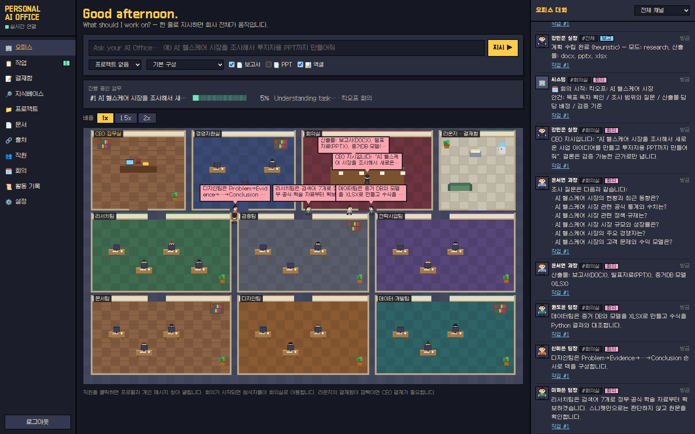
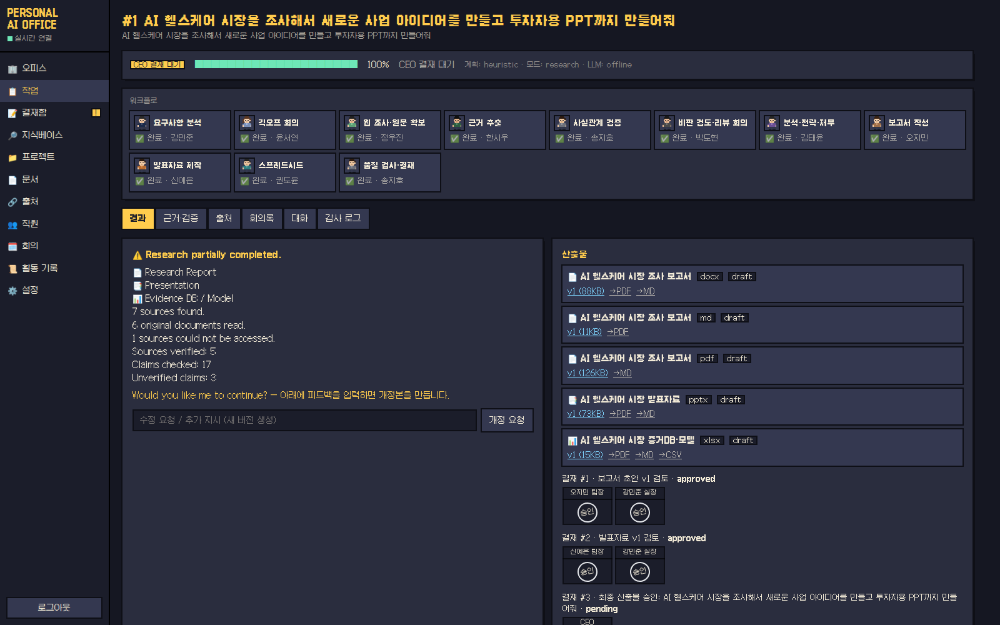
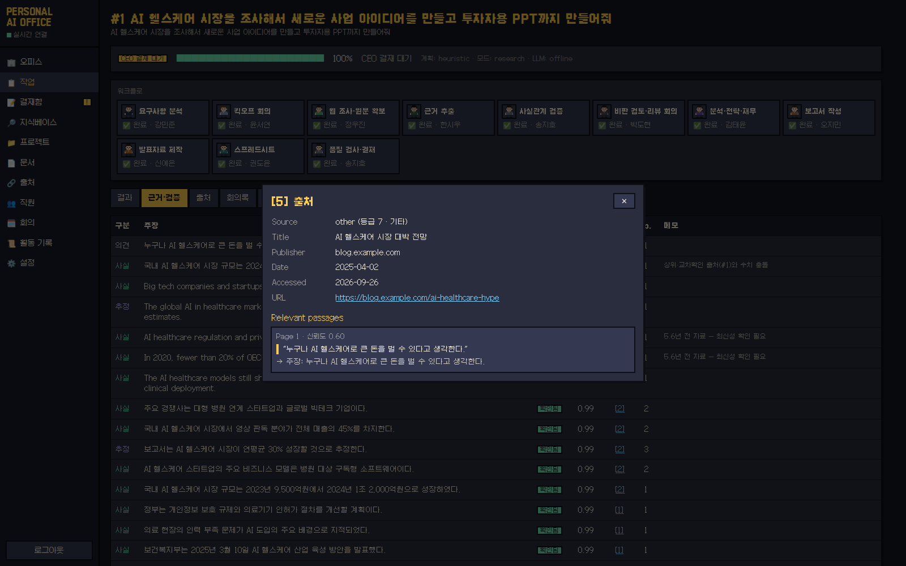
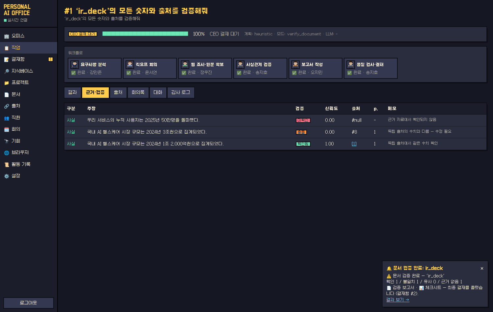
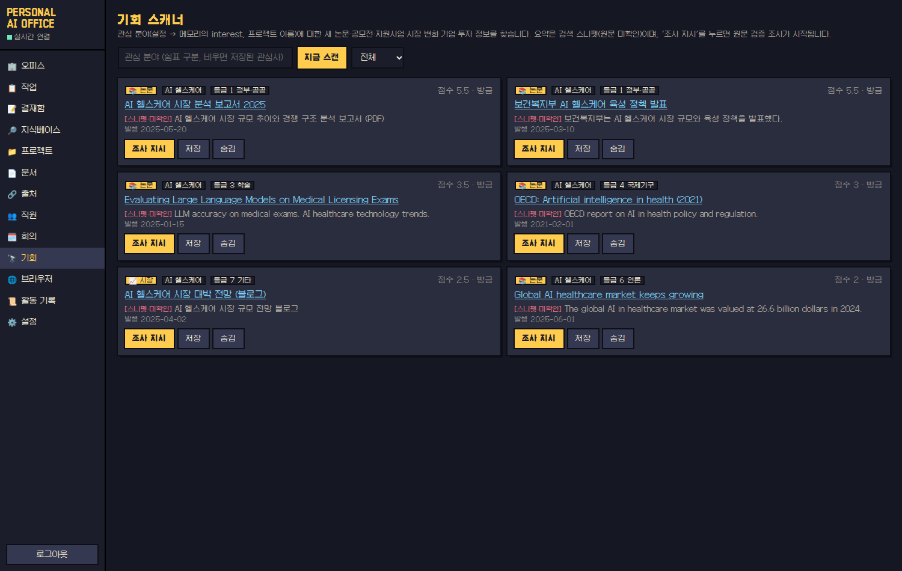

# Personal AI Office — 나를 위해 일하는 개인 AI 회사

한 줄로 업무를 지시하면 **7개 부서 22명의 AI 직원**이 요구사항 분석 → 킥오프 회의 → 웹 조사·원문 확보 → 근거 추출 →
사실관계 검증 → 비판 검토(리뷰 회의) → 분석·재무 모델 → 보고서(DOCX)·발표자료(PPTX)·증거DB(XLSX) 작성 → 품질 검사 →
결재까지 수행합니다. 모든 과정(대화, 회의, 결재)은 **픽셀아트 사무실**에서 실시간으로 볼 수 있고, 직원 누구에게나 개인 메시지를 보낼 수 있습니다.

> 목표는 “그럴듯한 답변”이 아니라 **검증 가능한 결과물**입니다. 모든 사실에는 원문 인용문·페이지·출처가 연결되고,
> 근거가 없으면 `UNKNOWN`으로 표시하며, 실패는 숨기지 않고 보고합니다.



| 작업 결과 & 결재 | 인용 카드 ([n] 클릭) |
|---|---|
|  |  |
| **문서 팩트체크** | **기회 스캐너** |
|  |  |

[`docs/samples/`](docs/samples) 에 데모 스냅샷으로 실제 생성된 보고서(DOCX/MD)·발표자료(PPTX)·증거DB/재무모델(XLSX)이 있습니다 (오프라인 모드 결과).

---

## 1. 빠른 시작

### 요구 사항
* Python 3.11+, Node.js 20+ (22 권장)
* (선택) Anthropic API 키 — 없으면 **오프라인 모드**(규칙·추출 기반, 문장을 지어내지 않음)로 동작
* (선택) 웹 검색 키 1개: Tavily / Brave / Serper, 또는 자체 호스팅 SearXNG
* (선택) Tesseract — 스캔 PDF·이미지 OCR (`tesseract-ocr tesseract-ocr-kor`), 한글 차트/PDF용 폰트 `fonts-nanum`

### 로컬 실행
```bash
git clone <repo> && cd office
cp .env.example .env              # SECRET_KEY, ADMIN_PASSWORD, (선택) ANTHROPIC_API_KEY, 검색 키 입력

# 백엔드 (FastAPI, 기본 SQLite, API 프로세스 안에서 백그라운드 워커 실행)
cd backend
python3 -m venv .venv && source .venv/bin/activate
pip install -r requirements-dev.txt
uvicorn app.main:app --reload --port 8000        # http://localhost:8000/docs (OpenAPI)

# 프런트엔드 (Next.js) — 다른 터미널
cd frontend
npm ci
NEXT_PUBLIC_API_URL=http://localhost:8000 npm run dev   # http://localhost:3000
```
`http://localhost:3000` 에서 `.env` 의 `ADMIN_USERNAME` / `ADMIN_PASSWORD` 로 로그인합니다.

### 검색 키 없이 데모하기 (리서치 스냅샷 재생)
```bash
cd backend
./scripts/demo_snapshot.sh            # 출력된 3줄을 .env 에 추가
```
정부 보도자료·연구원 PDF·논문·언론·**오래된 보고서**·**프롬프트 인젝션과 모순 수치가 들어있는 블로그**·접근 불가 URL로
구성된 “AI 헬스케어” 스냅샷을 사용합니다. `AI 헬스케어 시장을 조사해서 새로운 사업 아이디어를 만들고 투자자용 PPT까지 만들어줘`
라고 지시해 보세요. (`FETCH_MIRROR_DIR` 은 캡처한 원문을 재생하는 기능으로, 재현 가능한 조사·오프라인 환경에도 쓸 수 있습니다.)

### Docker
```bash
cp .env.example .env
docker compose up --build                         # api:8000, worker, web:3000 (SQLite 볼륨 공유)
docker compose --profile postgres up --build      # PostgreSQL(pgvector 이미지) 포함 — .env 에 DATABASE_URL 설정
```

### 테스트
```bash
cd backend && python -m playwright install chromium && python3 -m pytest -q   # 96 tests
cd frontend && npm run typecheck && npm run build
```

---

## 2. 사용 방법

| 하고 싶은 일 | 방법 |
|---|---|
| 업무 지시 | 오피스 화면 상단 입력창(“Ask your AI Office…”). 프로젝트·템플릿·산출물(보고서/PPT/엑셀) 선택 가능 |
| 진행 지켜보기 | 직원들이 회의실로 걸어가 회의하고, 말풍선·오른쪽 채널 피드로 대화가 실시간 표시됨. 진행률 HUD |
| 직원과 대화 | 캐릭터 클릭 → 프로필 + **개인 메시지(DM)**. “…조사해줘” 처럼 업무를 주면 작업으로 등록 |
| 결재 | 사이드바 **결재함** — 직원 → 팀장 → 실장 → CEO 결재선, 도장 UI. 반려 의견은 자동으로 개정 지시가 됨 |
| 결과 확인 | 작업 상세: 결과 요약(출처·검증 수), 산출물 버전(v1/v2/final) 다운로드·PDF/MD/CSV 변환, 근거·검증 표, 인용 카드, 회의록, 감사 로그 |
| 자료 업로드 | **지식베이스**: PDF/DOCX/PPTX/XLSX/TXT/MD/HTML/이미지 → 섹션·표·참고문헌 보존, 하이브리드 검색. “이 논문들을 읽고…” 지시 시 업로드 문서를 근거로 사용 |
| 회의 소집 | **회의**: 참석자·안건 선택 → 회의록(Decision / Action Item / Owner / Deadline / Status) |
| 브리핑 | **설정 → 오늘의 브리핑 / 주간 리뷰** (DOCX + 화면 요약) |
| 예약 자동화 | **설정 → 예약 자동화**: 매일/매주/매시간 데일리 브리핑·주간 리뷰·기회 스캔·반복 조사 (워커가 실행, 알림 발송) |
| 문서 팩트체크 | 지식베이스에서 문서의 **팩트체크** 버튼, 또는 “이 PPT의 모든 숫자와 출처를 검증해줘” → 문장별 확인/불일치/근거 없음 판정 보고서 + 체크시트 |
| 기회 스캐너 | **기회**: 관심 분야(메모리 `interest`·프로젝트)의 새 논문·공모전·지원사업·시장·기업·투자 소식. “조사 지시”로 원문 검증 조사 |
| 브라우저 에이전트 | **브라우저**: 사이트 열기·스크린샷·자료 추출(LOW), 다운로드→지식베이스(MEDIUM), 폼 제출(HIGH·결재). 로그인 세션은 storage_state JSON 등록 |
| 알림 · 모바일 | 작업 완료 시 화면 토스트 + 브라우저 알림(설정에서 허용). 휴대폰 화면 대응, 홈 화면에 앱으로 추가(PWA) |
| 메모리 | **설정 → 메모리**: preference/project/company/person/document/decision/task/fact/temporary 계층, 명시(explicit)·자동(auto) 구분 |

---

## 3. 아키텍처

자세한 설계는 [`docs/ARCHITECTURE.md`](docs/ARCHITECTURE.md) 참고.

```
USER(CEO) ─ 픽셀 오피스 UI (Next.js) ──REST+SSE──▶ FastAPI
                                                    ├─ Job Queue (DB 기반) ─▶ Worker
                                                    ├─ Office layer: 직원·채널·메시지·결재·회의·DM
                                                    ├─ Knowledge Base: 파서 → 청크 → 임베딩 → BM25+벡터(RRF)
                                                    └─ Research-to-Artifact Pipeline
   Plan → Kickoff → Research → Extract → Verify → Critic/Debate(↺재조사) → Analyze → Write → Present → Data → QC → 결재
        Agents(판단) ──▶ Tools(검색·fetch·계산·파일, 위험도 게이트) ──▶ Artifacts(버전) ──▶ Verification
        Model Router ──▶ Anthropic (claude-opus-5 / claude-haiku-4-5) | Offline 결정론 엔진
```

### 조직 (7개 부서 · 부서당 3명 이상)
| 부서 | 직원 | 역할 |
|---|---|---|
| 경영지원실 | 강민준 실장, 윤서연 과장, 박도현 차장 | Orchestrator(업무 분해·통합), 기획·회의 진행, **Critic**(비판 검토) |
| 리서치팀 | 이하은 팀장, 정우진, 최유나, 한시우 | 병렬 검색, 원문 확보·분석, 통계·근거 추출 |
| 검증팀 | 송지호 팀장, 임나래, 조현우 | 인용문 원문 대조, 출처·날짜, 숫자 감사 |
| 전략사업팀 | 김태윤 팀장, 서민아, 배준호 | 전략·SWOT·KPI·로드맵, 사업모델, 재무 모델 |
| 문서팀 | 오지민 팀장, 류하린, 문성호 | 보고서(DOCX), 각주·참고문헌, 교정 |
| 디자인팀 | 신예은 팀장, 황재민, 노아린 | PPTX 스토리라인, 도식, 차트 |
| 데이터·개발팀 | 권도윤 팀장, 전서진, 남궁현 | XLSX 모델·수식 검증, 데이터 분석, Coding Agent |

### 정확성 장치 (hallucination 최소화)
1. **스니펫은 근거가 아님** — 원문(웹/PDF)을 내려받아 파싱한 출처에서만 주장을 추출
2. **인용문 원문 대조** — 주장의 supporting quote 가 원문에 그대로 있어야 `verified` (퍼지 일치는 최대 `partially_verified`)
3. **숫자 검사** — 주장 속 숫자는 인용문과 원문 모두에 있어야 함 (숫자만 바꾼 인용 탐지)
4. **날짜** — 발행일 미상·`STALE_AFTER_YEARS` 초과 자료 표시(`outdated`)
5. **교차 검증** — 다른 호스트의 같은 수치는 corroboration, 같은 연도·지표의 다른 수치는 **충돌** 탐지. 상위 등급 + 교차 확인된 쪽 채택, 나머지는 `contradicted`
6. **LLM 출력 가드** — LLM이 `FACT`로 쓴 문장도 유효한 claim id가 없거나 근거에 없는 숫자를 포함하면 `ANALYSIS`/`UNKNOWN`으로 강등
7. **계산은 코드가** — 재무 모델은 Python으로 계산, XLSX에는 실제 수식을 쓰고 수식 평가 결과와 Python 결과를 대조
8. **Critic + 리뷰 회의** — 검증 비율·질문별 근거 공백·출처 등급 편중·충돌·오래된 자료를 지적, 기준 미달이면 재조사 라운드
9. **QC 체크리스트** — 출처 존재/지원, 날짜, 숫자, 중복, 충돌, 오래된 자료, hallucination 가능성, 요구사항, 문서 형식
10. **정직한 보고** — “Research partially completed. N sources found. M could not be accessed. K claims unverified.”

### 보안
* 비밀은 환경변수만 사용(`.env`는 git 제외), PBKDF2 비밀번호, HMAC 서명 토큰, CORS 제한
* 외부 문서·웹 텍스트는 `<untrusted_document>` 경계로 감싸고 경계 태그를 중화, 인젝션 패턴 탐지·표시, 지시문 형태의 문장은 근거로 채택하지 않음
* 도구 위험도: LOW(검색·분석·문서) / MEDIUM(파일 수정·일정) / **HIGH(외부 이메일·게시) / CRITICAL(결제·계약·삭제)** → HIGH 이상은 CEO 결재 후에만 실행
* 파일 접근은 워크스페이스 내부로 제한(경로 탈출 차단), 업로드 실행파일 거부, SSRF 차단(사설 IP·비 HTTP 스킴)
* 감사 로그(민감정보 마스킹: API 키, 이메일, 주민번호, 카드번호)

---

## 4. 기술 스택
| 영역 | 사용 |
|---|---|
| Backend | Python 3.11, FastAPI, SQLAlchemy 2 (SQLite / PostgreSQL), Pydantic v2 |
| AI | Anthropic SDK + Model Router(fast/reasoning/coding/long-context/multimodal), Offline 엔진 |
| 문서 | python-docx, python-pptx, openpyxl, PyMuPDF(+Tesseract OCR), BeautifulSoup |
| 분석 | NumPy, Pandas, Matplotlib |
| 검색 | Tavily / Brave / Serper / SearXNG / 스냅샷 재생, BM25 + 벡터 RRF 하이브리드 검색 |
| Jobs | DB 기반 큐 + 워커 프로세스 (`python -m app.worker`) + 스케줄러(중복 실행 방지) |
| Browser | Playwright (headless Chromium) — JS 페이지 렌더링 폴백, 승인 게이트 |
| Frontend | Next.js 14, React 18, TypeScript, Tailwind CSS, Canvas 픽셀아트(에셋 없이 코드로 그림), Galmuri 픽셀 폰트 |
| 배포 | Docker, Docker Compose |

## 5. REST API (요약 — 전체는 `/docs`)
```
POST /api/auth/login                 GET  /api/health
POST /api/tasks        GET /api/tasks        GET /api/tasks/{id}      PATCH /api/tasks/{id}
POST /api/tasks/{id}/revise          POST /api/tasks/{id}/retry     GET /api/tasks/{id}/audit
POST /api/research     POST /api/presentations    POST /api/coding    POST /api/coding/analyze
POST /api/documents (업로드)  GET /api/documents  GET /api/search?q=  GET /api/sources  GET /api/claims
GET  /api/citations/{task_id}        GET /api/artifacts  GET /api/artifacts/{id}/download  GET /api/artifacts/{id}/export?format=pdf|md|txt|csv
GET  /api/projects  POST /api/projects  GET /api/files/tree
GET  /api/approvals POST /api/approvals/{id}/decide
GET  /api/office/layout  /employees  /channels  /messages   POST /api/office/dm/{employee_id}   POST /api/office/meetings
GET  /api/events/stream (SSE)   GET /api/notifications   POST /api/briefing/daily|weekly
GET/POST/DELETE /api/memory     GET/POST /api/templates   GET /api/plugins   GET /api/tools   POST /api/tools/{name}/execute
GET  /api/settings   GET /api/audit   GET /api/files/raw?path=
GET/POST /api/schedules   PATCH/DELETE /api/schedules/{id}   POST /api/schedules/{id}/run
GET  /api/opportunities   POST /api/opportunities/scan   POST /api/opportunities/{id}/task|status
GET/POST /api/browser/profiles   (브라우저 동작은 POST /api/tools/browser.*/execute — 위험도 게이트 적용)
```

## 6. 확장
* **플러그인**: `backend/app/plugins/base.py` — Slack, Discord, GitHub, Notion, Gmail, Calendar, Drive, Sheets, Dropbox.
  각 액션은 위험도와 함께 도구 레지스트리에 등록되어 결재 게이트를 거칩니다. 환경변수가 없으면 “미연결”로 표시됩니다.
* **새 에이전트**: `app/agents/base.py`의 `Agent`를 상속하고 `agent_type`에 해당하는 직원을 `office/roster.py`에 추가
* **새 검색 제공자**: `app/tools/web.py`의 `SearchProvider` 프로토콜 구현
* **Opportunity Scanner / 장기 자동화**: Job 큐에 새 handler(`app/jobs/handlers.py`)를 등록하고 주기 실행

## 7. 현재 한계 (정직한 목록)
* 이 저장소를 개발한 컨테이너는 외부 웹 접근이 차단되어 있어, 웹 조사 E2E는 **리서치 스냅샷**(실제 파서·검증·생성 코드 경유)으로 테스트했습니다.
  실제 검색 API·플러그인 API·Anthropic API 호출은 인터페이스만 실제 엔드포인트대로 구현되어 있고 이 환경에서 실호출 검증은 하지 못했습니다.
* 같은 이유로 Docker 이미지 빌드(apt·Playwright 설치 단계)는 이 환경에서 끝까지 검증하지 못했습니다. GitHub Actions CI(`.github/workflows/ci.yml`)가 테스트와 프런트 빌드를 실행합니다.
* 오프라인 모드에서는 해결방안·전략 같은 생성형 섹션을 `UNKNOWN`으로 둡니다(의도된 동작). LLM 키를 넣으면 채워집니다.
* 기본 임베딩(`hash`)은 어휘 기반입니다. 의미 검색 품질이 필요하면 `EMBEDDING_PROVIDER=voyage`.
* 벡터는 DB 컬럼에 저장해 NumPy로 검색합니다(수만 청크 규모까지 적합). 대규모는 pgvector 인덱스로 교체 권장.
* 모바일은 반응형 웹 + PWA 입니다(네이티브 앱 아님). 알림은 브라우저가 열려 있을 때 동작합니다(웹 푸시 서버 없음).
* 기회 스캐너 결과의 요약은 검색 스니펫이라 “미확인”으로 표시됩니다. 사실로 쓰려면 “조사 지시”로 원문 검증을 거치세요.
